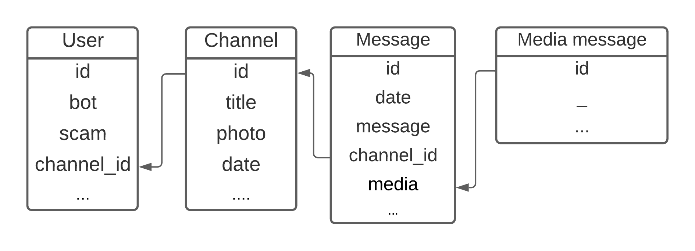

# Multimodal Pipeline for Collection of Misinformation Data from Telegram


<p align="center">
  <a href="https://scholar.google.com/citations?user=R6rtktIAAAAJ&hl=en">Jose Sosa</a>
  &nbsp;&nbsp;·&nbsp;&nbsp;
  <a href="https://scholar.google.com/citations?user=qcnf4QsAAAAJ&hl=en">Serge Sharoff</a>
</p>

<p align="center">
  <a href="http://www.lrec-conf.org/proceedings/lrec2022/pdf/2022.lrec-1.159.pdf">
    
  </a>
  <a href="https://arxiv.org/abs/2204.12690">
    
  </a>
</p>

## 📝 Abstract
> *The paper presents the outcomes of AI-COVID19, our project aimed at better understanding of misinformation flow about COVID-19 across social media platforms. The specific focus of the study reported in this paper is on collecting data from Telegram groups which are active in promotion of COVID-related misinformation. Our corpus collected so far contains around 28 million words, from almost one million messages. Given that a substantial portion of misinformation flow in social media is spread via multimodal means, such as images and video, we have also developed a mechanism for utilising such channels via producing automatic transcripts for videos and automatic classification for images into such categories as memes, screenshots of posts and other kinds of images. The accuracy of the image classification pipeline is around 87%.*

## 📖 Overview

This repository contains the data collection pipeline presented in our **LREC 2022** paper:

> **Multimodal Pipeline for Collection of Misinformation Data from Telegram**

The pipeline uses the **Telegram API** to collect multimodal data from a predefined set of public Telegram channels and users. The collected data can include:

- 💬 Messages and associated metadata
- 📢 Channel information
- 👤 User information
- 🖼️ Images
- 🎥 Videos
- 📄 Documents
- 📝 Video transcripts

The pipeline is designed for **daily data collection**, enabling the construction of multimodal datasets from Telegram.

## 🚀 Getting Started

### 1. Telegram API Access

This project uses the official Telegram API. Before running the pipeline, you need to create a Telegram application and obtain the required API credentials. Instructions are available at:

👉 https://core.telegram.org/

> [!IMPORTANT]
> Never commit Telegram API credentials or other sensitive information to GitHub.


### 2. Installation

Clone the repository:

```bash
git clone https://github.com/josesosajs/telegram-data-collection.git
cd telegram-data-collection
```

We recommend creating a dedicated virtual environment:

```bash
python3 -m venv .venv
source .venv/bin/activate
```

Install the required dependencies:

```bash
pip install -r requirements.txt
```


## 🔑 API Configuration

Configure your Telegram API credentials and other parameters in:

```text
config.yaml
```

Make sure that this file is included in `.gitignore`. Alternatively, credentials can be stored using environment variables or another secrets-management solution.

---

## 📡 Channel Configuration

The pipeline requires a `.txt` file containing the Telegram channels/users from which data should be collected. An example is provided in:

```text
my_channels_list.txt
```

The file should contain one Telegram identifier per line:

```text
nocovidvaccines
UNVACCINATE
OneRepublicNetwork
TheUnvaccinatedArmsChat
SeniorChaplain
HVUNetwork
ChlorineDioxideTestimonies
Truthers4victory
TheDonsNightShift
Seventeen76777CHAT
CampQueenKong
unvaccinatedDOTonline
```

> [!NOTE]
> These identifiers are included only as an example of the expected configuration format.


## ▶️ Running the Pipeline

Run the collection script with:

```bash
python3 get_telegram_data.py
```

The pipeline is designed to run **once per day**. When executed, it collects data corresponding to the previous day. For continuous data collection, the script can be scheduled using `cron` or another job scheduler.


## 📂 Output Structure

The pipeline creates a separate directory for each collection date. For example:

```text
root_to_data/
└── 2022-04-05/
    ├── telegram_channels.json
    ├── telegram_messages.json
    ├── telegram_messages_media.json
    ├── telegram_users.json
    └── media/
        ├── images/
        ├── videos/
        ├── documents/
        └── transcripts/
```

Four main JSON files are generated:

| File | Description |
|---|---|
| `telegram_channels.json` | Metadata associated with collected Telegram channels |
| `telegram_messages.json` | Collected Telegram messages and associated metadata |
| `telegram_messages_media.json` | Relationships between messages and downloaded media |
| `telegram_users.json` | Information associated with collected Telegram users |

Downloaded multimodal content is stored under the `media/` directory.


## 🔗 Data Model

The following entity-relationship diagram illustrates the relationships between the generated data files:

<p align="center">
  
</p>


## 🎥 Video Transcription

In addition to the Telegram data collection pipeline, this repository includes functionality for generating transcripts from downloaded Telegram videos. A complete daily workflow can combine:

1. Telegram data collection
2. Media organization
3. Video transcription
4. Optional transcript statistics

<details>
<summary><b>Example daily collection and transcription script</b></summary>

<br>

```bash
#!/bin/bash -l

# Get yesterday's date.
yesterday=$(date -d "yesterday 13:00" '+%Y-%m-%d')

# ----------------------------------------------------------
# Activate your virtual environment
# ----------------------------------------------------------

# source /path/to/.venv/bin/activate

# ----------------------------------------------------------
# 1. Collect Telegram data
# ----------------------------------------------------------

python3 get_telegram_data.py

# ----------------------------------------------------------
# 2. Organize downloaded media
# ----------------------------------------------------------

mkdir -p root_to_data/$yesterday/media/images
mkdir -p root_to_data/$yesterday/media/videos
mkdir -p root_to_data/$yesterday/media/documents

mv root_to_data/$yesterday/media/*.jpg \
   root_to_data/$yesterday/media/images 2>/dev/null

mv root_to_data/$yesterday/media/*.mp4 \
   root_to_data/$yesterday/media/videos 2>/dev/null

mv root_to_data/$yesterday/media/*.pdf \
   root_to_data/$yesterday/media/documents 2>/dev/null

# ----------------------------------------------------------
# 3. Generate video transcripts
# ----------------------------------------------------------

python3 get_transcript.py $yesterday

mkdir -p root_to_data/$yesterday/media/transcripts

mv root_to_data/$yesterday/media/videos/*.txt \
   root_to_data/$yesterday/media/transcripts 2>/dev/null

# ----------------------------------------------------------
# 4. Optional: Generate transcript statistics
# ----------------------------------------------------------

python3 transcripts_stast.py $yesterday
```

</details>

Run the workflow with:

```bash
chmod +x my_collection_script.sh
./my_collection_script.sh
```

The script can also be scheduled as a daily cron job.

## 📚 Citation

If you use this repository or pipeline in your research, please cite our **LREC 2022** paper:

```bibtex
@inproceedings{sosa2022multimodal,
  title={Multimodal pipeline for collection of misinformation data from telegram},
  author={Sosa, Jose and Sharoff, Serge},
  booktitle={Proceedings of the thirteenth language resources and evaluation conference},
  pages={1480--1489},
  year={2022}
}
```
