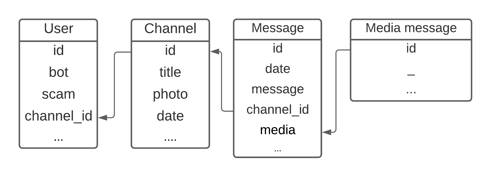

# Automatic pipeline for collecting Telegram multimodal data

Note: This code uses Telegram API in order to get the data. Make sure you have requested access before starting. For detailed instructions on how to request the access to the Telegram API, and how to generate the needed tokens, have a look at: https://core.telegram.org/

## Installation 

Create and activate a virtual environemnt. Then, install all the required packages
 ```
 pip install -r /path/to/requirements.txt
```

## API token 
Create a .yaml file called ***config.yaml*** to store your keys and other configuracion variables. It should have the following strcuture: 

```
root_path: 'my_path'
channels_file: 'my_channels_list.txt'
api_id: 'my_api_id'
api_hash: 'my_api_hash'
test: 'my_test'
test_public_key: 'my_test_key'
prod: 'my_prod'
prod_public_key: 'my_prod_key'
phone: 'my_phone'
user: 'my_user'
```

Remember to keep this file on the .gitignore since it contains sensible information. Alternativetly, you could use another method to store your API keys. Feel free to adapt the code as needed.


## Configuration
In addition you will have to provide a .txt file with a list of users id that you would like to start to get data from. Here is an example:

```
nocovidvaccines
UNVACCINATE
OneRepublicNetwork
TheUnvaccinatedArmsChat
SeniorChaplain
HVUNetwork
ChlorineDioxideTestimonies
Truthers4victory
TheDonsNightShift
Seventeen76777CHAT
CampQueenKong
unvaccinatedDOTonline
```

## Running the code
Note that the code is designed to run in a daily basis. When running for the first time you will get data from the day before running the script. For testing, inside your virtual environment, just simply run:
```
python3 get_telegram_data.py
```

If you want the collection to run everyday, just add the command into a cronjob.

## Files structure
The script is designed to run in a daily basis. Thus, it will create a folder inside the selected path for each day, e.g. ***2022-04-05***. Inside the folder you will find 4 json files: ***telegram_channels.json, telegram_messages.json, telegram_messages_media.json, and telegram_users.json***, containing the data. Aditionally, it will create a folder called ***media*** to store the multimodal data, i.e. images, videos, and documents.

The next ER diagram shows the relationship between the files.


## Getting video transcripts

Aditionally to our data collection pipeline, we added a script to get transcripts from the dowloaded Telegram videos. To integrate this step to the data collection create a .sh file with the following structure:
```
#!/bin/bash -l
#Get yesterday date, we will need to send this as parameter
yesterday=$(date -d "yesterday 13:00" '+%Y-%m-%d')

#Activate your virtual env

#Run collection pipeline, this could take a while. It will depend on the number of users that you would like to get data from.
python3 get_telegram_data.py

#Create folders to organise media
mkdir root_to_data/$yesterday/media/images
mkdir root_to_data/$yesterday/media/videos
mkdir root_to_data/$yesterday/media/documents

#Moving data to corresponding folder
mv root_to_data/$yesterday/media/*.jpg root_to_data/$yesterday/media/images
mv root_to_data/$yesterday/media/*.mp4 root_to_data/$yesterday/media/videos
mv root_to_data/$yesterday/media/*.pdf root_to_data/$yesterday/media/documents

#Run script to get transcripts
python3 /home/home01/scjasm/data-collection/telegram/get_transcript.py $yesterday

#Create folder for transcript
mkdir root_to_data/$yesterday/media/transcripts

#Move transcripts to corresponding folder
mv root_to_data/$yesterday/media/videos/*.txt root_to_data/$yesterday/media/transcripts

#OPTIONAL: Produce an excel file with a summary of the transcripts
python3 transcripts_stast.py $yesterday
```

Finally, just run your .sh file, or locate it inside a cronjob:
```
./my_sh_file.sh
```